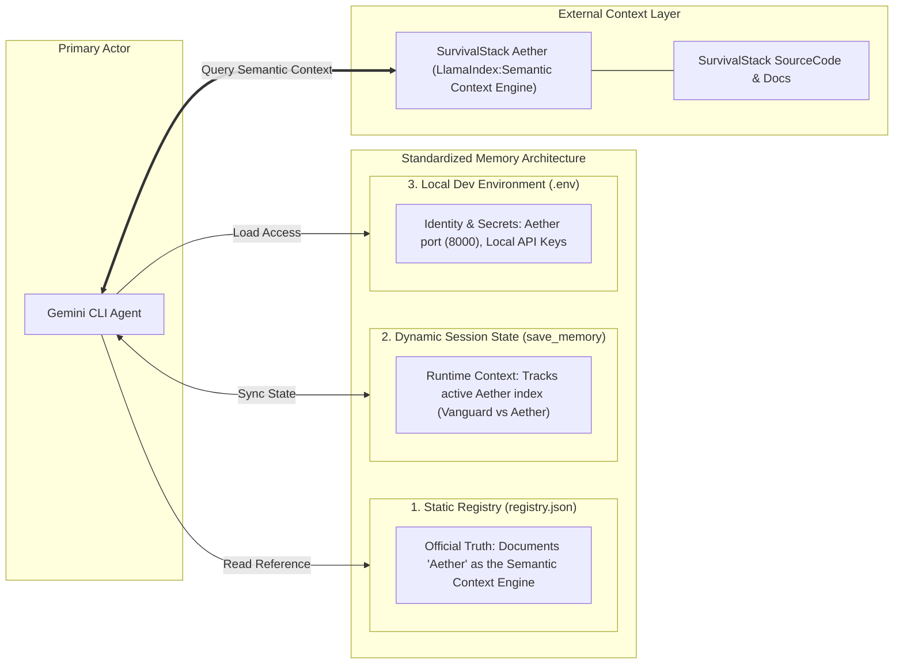

# Gemini Memory Architecture

This directory defines the configuration and operational protocols for the Gemini CLI agent within the SurvivalStack ecosystem.

## Three-Store Architecture

```mermaid
graph LR
    subgraph Agent_Node ["Primary Actor"]
        Agent[Gemini CLI Agent]
    end

    subgraph Storage_Tiers ["Standardized Memory Architecture"]
        direction TB
        
        subgraph Static ["1. Static Registry (registry.json)"]
            S1["Official Truth: Documents 'Aether' as the Semantic Context Engine"]
        end
        
        subgraph Dynamic ["2. Dynamic Session State (save_memory)"]
            D1["Runtime Context: Tracks active Aether index (Vanguard vs Aether)"]
        end
        
        subgraph Local ["3. Local Dev Environment (.env)"]
            L1["Identity & Secrets: Aether port (8000), Local API Keys"]
        end
    end

    subgraph Services ["External Context Layer"]
        Aether["SurvivalStack Aether (LlamaIndex:Semantic Context Engine)"]
        Aether --- Index["SurvivalStack SourceCode & Docs"]
    end

    Agent -->|Read Reference| Static
    Agent <-->|Sync State| Dynamic
    Agent -->|Load Access| Local
    Agent <==>|Query Semantic Context| Aether
```
